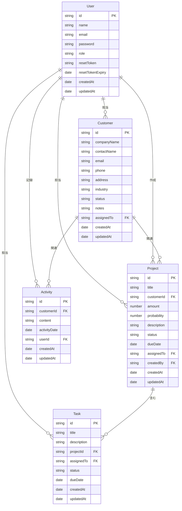
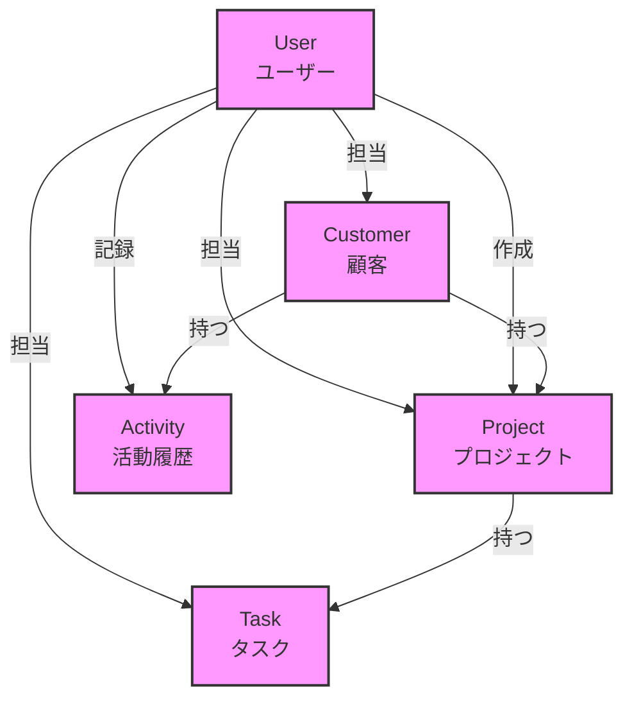

# CRMシステム データモデル図

## draw.ioでの閲覧方法
以下のリンクからdraw.ioで開いてください：
https://app.diagrams.net/?mode=github

## データベース ER図 (Mermaid)

## モデル関連図

## 各モデルの詳細

### User (ユーザー)
- `id`: 一意識別子
- `name`: ユーザー名
- `email`: メールアドレス（ログインID）
- `password`: パスワード（ハッシュ化）
- `role`: 権限（'ADMIN'または'USER'）
- `resetToken`: パスワードリセット用トークン
- `resetTokenExpiry`: トークン有効期限
- `createdAt`: 作成日時
- `updatedAt`: 更新日時

### Customer (顧客)
- `id`: 一意識別子
- `companyName`: 会社名
- `contactName`: 担当者名
- `email`: メールアドレス
- `phone`: 電話番号
- `address`: 住所
- `industry`: 業種
- `status`: ステータス（'リード'/'商談中'/'成約'/'失注'）
- `notes`: メモ
- `assignedTo`: 担当ユーザーID
- `createdAt`: 作成日時
- `updatedAt`: 更新日時

### Project (プロジェクト)
- `id`: 一意識別子
- `title`: タイトル
- `customerId`: 顧客ID
- `amount`: 金額
- `probability`: 成約確度（%）
- `description`: 説明
- `status`: ステータス（'PROPOSAL'/'NEGOTIATION'/'WON'/'LOST'）
- `dueDate`: 期日
- `assignedTo`: 担当ユーザーID
- `createdBy`: 作成者ユーザーID
- `createdAt`: 作成日時
- `updatedAt`: 更新日時

### Task (タスク)
- `id`: 一意識別子
- `title`: タイトル
- `description`: 説明
- `projectId`: プロジェクトID
- `assignedTo`: 担当ユーザーID
- `status`: ステータス（'TODO'/'IN_PROGRESS'/'DONE'）
- `dueDate`: 期日
- `createdAt`: 作成日時
- `updatedAt`: 更新日時

### Activity (活動履歴)
- `id`: 一意識別子
- `customerId`: 顧客ID
- `content`: 活動内容
- `activityDate`: 活動日時
- `userId`: 記録ユーザーID
- `createdAt`: 作成日時
- `updatedAt`: 更新日時 